# Joylight Programming using the Arduino IDE

If you bought the DIY JoyLight kit, the Seeeduino XIAO microcontroller board came unprogrammed and you will have to program it on your own. Luckily, it's pretty straight forward and you might even be able to skip some steps if you've used the Arduino IDE before. 

Getting the Arduino IDE set up will also ensure that you're ready to start modifying your firmware! You can customize the JoyLight to include your own favorite colors, come up with cool new animations, or even rewrite what the buttons do. 

Before you begin setting up the software, let's make sure that you have everything you need:
* One fully assembled JoyLight. If you still need to assemble your JoyLight, check out the links for the [Electronics Assembly](ElectronicsAssembly.md), [Enclosure 3D Printing](Enclosure3dPrinting.md) and [Enclosure Assembly](EnclosureAssembly.md)
* One USB type C cable - included with your JoyLight kit.

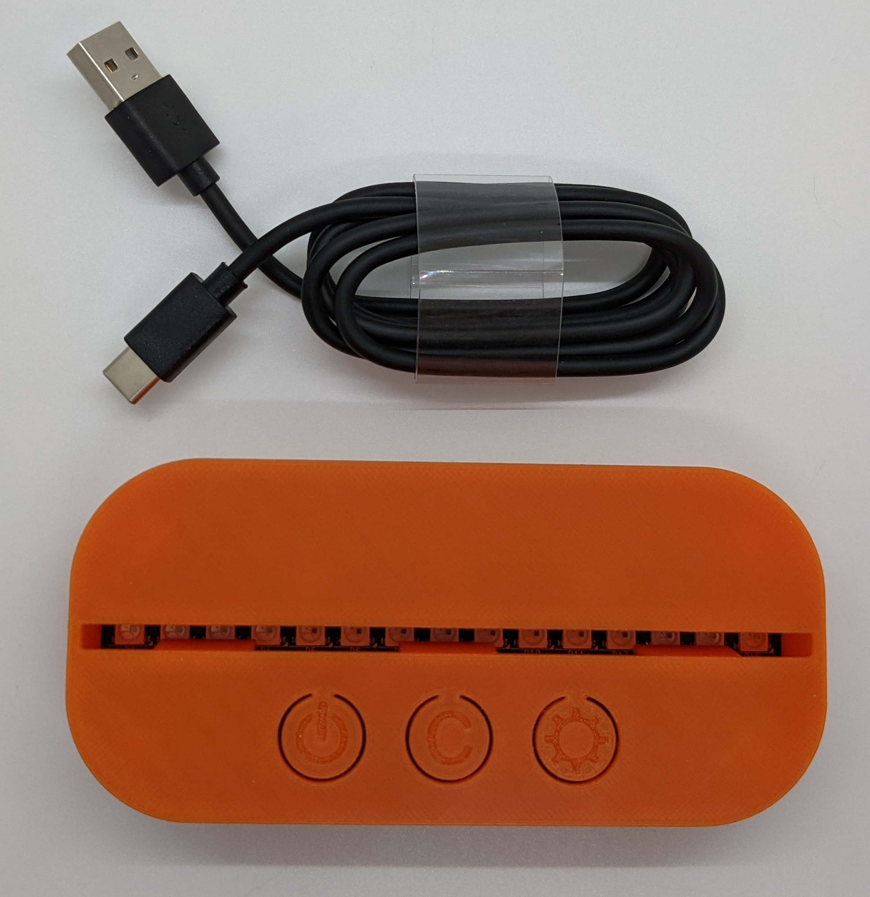

*Note: these instructions are written for Windows 10. However, the process should be similar for macOS.

## Step 1

Download and Install the Arduino IDE https://www.arduino.cc/en/software

## Step 2

We will now need to install the FastLED library. This is the library that allows our code to easily interface with the WS2812 smart LEDs that are part of the JoyLight. 

Open the Arduino IDE. Go to Tools -> Manage Libraries:

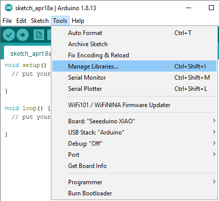

Search for "FastLED". Install the library:

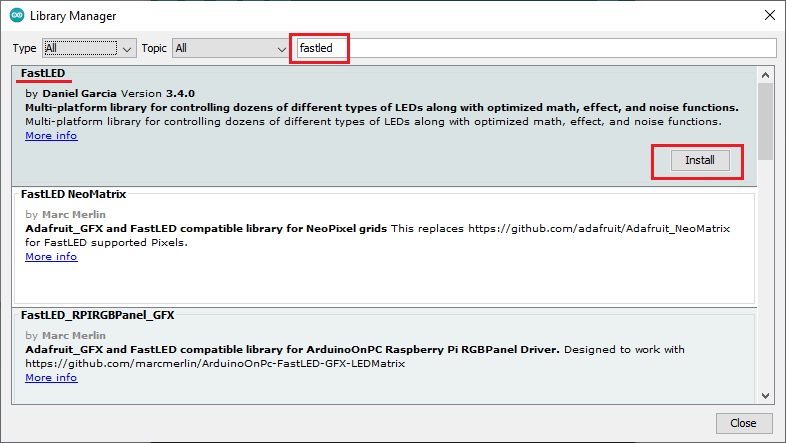

You can now close the Library Manager.

## Step 3

We now need to add support for the Seeeduino XIAO to the Arduino IDE. First, we'll need to tell Arduino about the Seeeduino board repository. 

Go to File -> Preferences

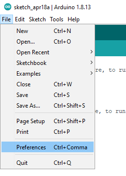

Under "Additional Goards Manager URLs" enter the following:

https://files.seeedstudio.com/arduino/package_seeeduino_boards_index.json

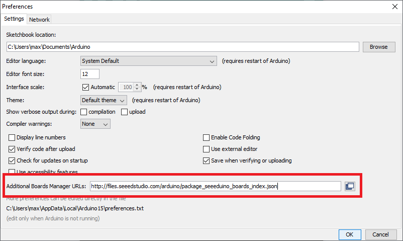

Press ok to close the Preferences window.

Now that Arduino knows where to find information about the Seeeduino boards, we can install the board itself.

Go to Tools -> Board "..." -> Board manager. Search for XIAO. Press install:

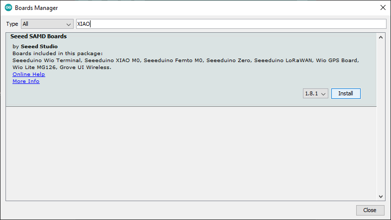

## Step 4

The Arduino IDE should now have full support for the Seeeduino XIAO. 

Select the board by going to Tools -> Board "..." -> Seeed SAMD (...) Boards -> Seeeduino XIAO

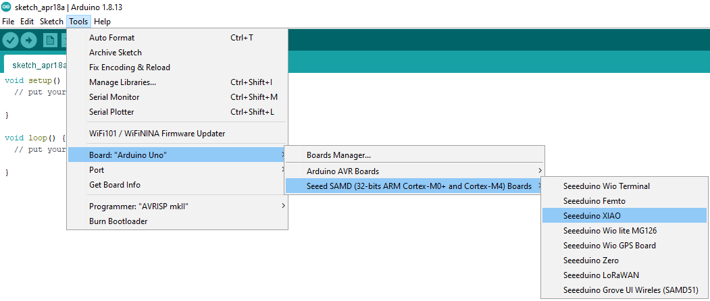

You can confirm that the board has been selected by checking the bottom status bar. Ignore the COM port for now:

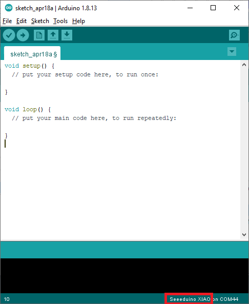

## Step 5

It's now time to load the sketch containing the source code for the JoyLight. Instead of downloading the entire [git repo](/), we'll provide instructions for copying a single file containing the arduino sketch.

Open 

[firmware/firmware.ino](/firmware/firmware.ino)

Near the top of the page, press "Raw"

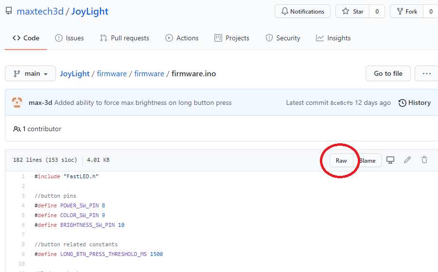

Select the entire text using "Ctrl + A". Right click and press Copy:

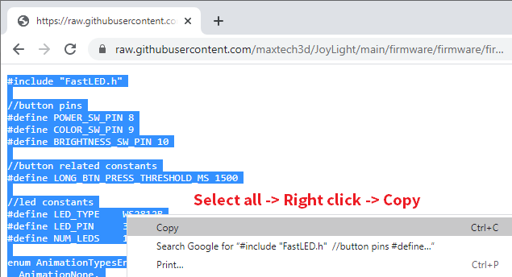

Go back to the Arduino IDE. You should have a blank sketch open. If not, press File->New to open a blank sketch.

Delete all the code from your sketch (you do not need the blank setup and loop functions). Then right click in the code area and select "Paste":

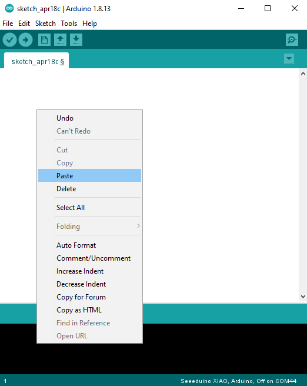

Save the file using File->Save. Then press the green checkmark icon to verify the sketch. You should get a "Done compiling" message. Ignore the #pragma message from the FastLED library, that's completely normal. It just tells you the version of the library currently installed.

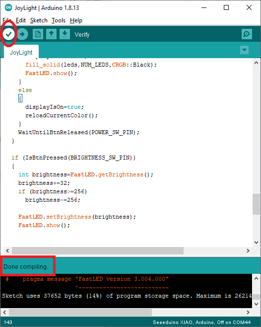

Here are a few troubleshooting steps in case you get any errors:
- redefinition of 'void setup()': verify that you've deleted the original blank setup() and loop() functions
- other errors: verrify that you have copied the entire contents of the firmware.ino file

## Step 6

Just like most other Arduino based products, our board relies on a Serial COM port for programming the firmware. You now need to figure out which COM Port is associated with your specific board.

One easy way to do so is to open the "Tools -> Port" menu with the board disconnected. Note which COM ports currently show up, if any. 

Then close the menu, plug in the JoyLight via USB, wait for at least 10 seconds and check the "Tools -> Port" menu again. You should see a new COM port entry that corresponds to the newly plugged in JoyLight. Press on the COM port to select it.

See the screenshot below as an example. In my case, the JoyLight identified as COM4 (the port number will most likely be different in your case): 

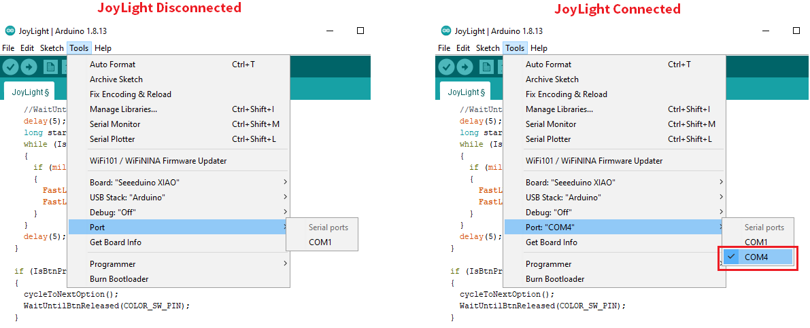

If the JoyLight doesn't identify, then open Device Manager and look under "Ports (COM & LPT)". The board should identify as "USB Serial Device (COM...)".

## Step 7

Now we're finally ready to program the JoyLight! 

If all went well so far, it should be as easy as pressing the Upload icon (it's the one with the arrow pointing to the right ->). 

After a few seconds you should get a "Done Uploading" message, and then the LEDs should light up in a rainbow pattern. Success! 

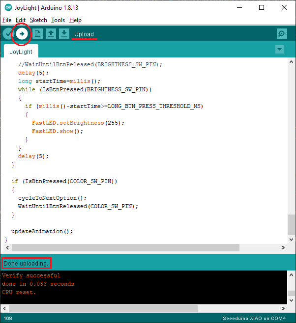

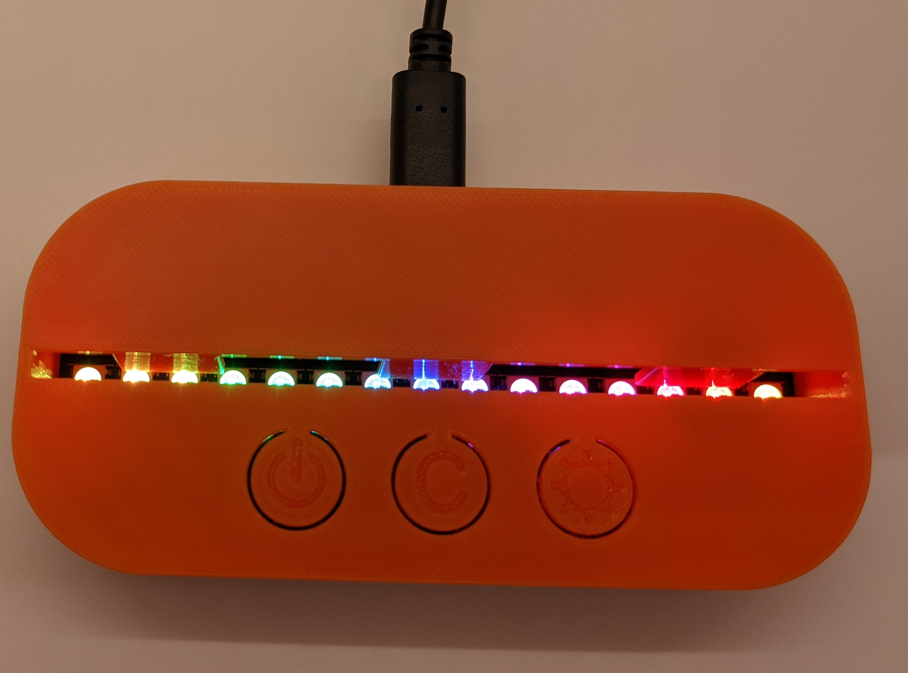

You can now insert the acrylic panel if you have one, or proceed to [laser cutting your own](AcrylicLaserCutting.md)!

Use the three buttons to turn on/off the display, cycle through the colors/animations and change the brightness. You can also modify the firmware to get them to do whatever you like! 