# Electronics Assembly
Looks like you're a maker who has decided to assemble your own JoyLight... Or maybe you want to learn more about electronics... Regardless, we're happy to guide you along the way!
## Getting ready
**The following is included in the official JoyLight kit:**
* One JoyLight PCB
* One Seeeduino XIAO kit (includes two pin headers and a set of stickers)
* One Assembly helper (helps keep the XIAO in place for soldering)
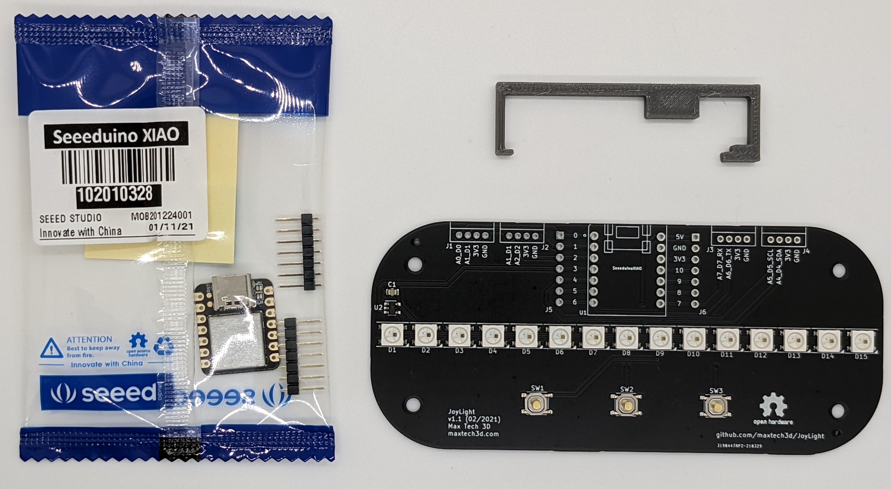

**You will need the following tools for assembly**
* Soldering iron and solder wire - to be used for soldering the XIAO to the JoyLight PCB
* Electronics Flush Cut Pliers - to be used for trimming the pins that come with the XIAO. 
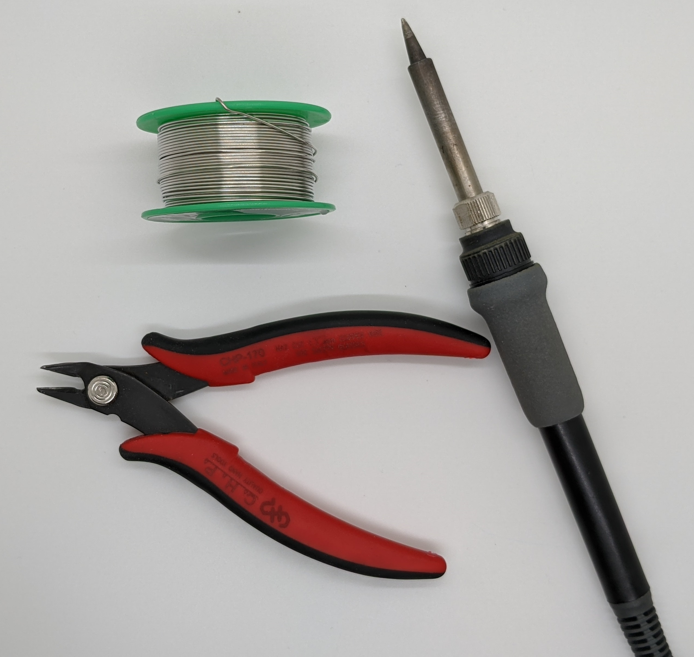

## Step 1
Carefully open the pack containing the Seeeduino XIAO kit. You'll find the XIAO itself, as well as two pin headers and a set of stickers showing the pin numbers.
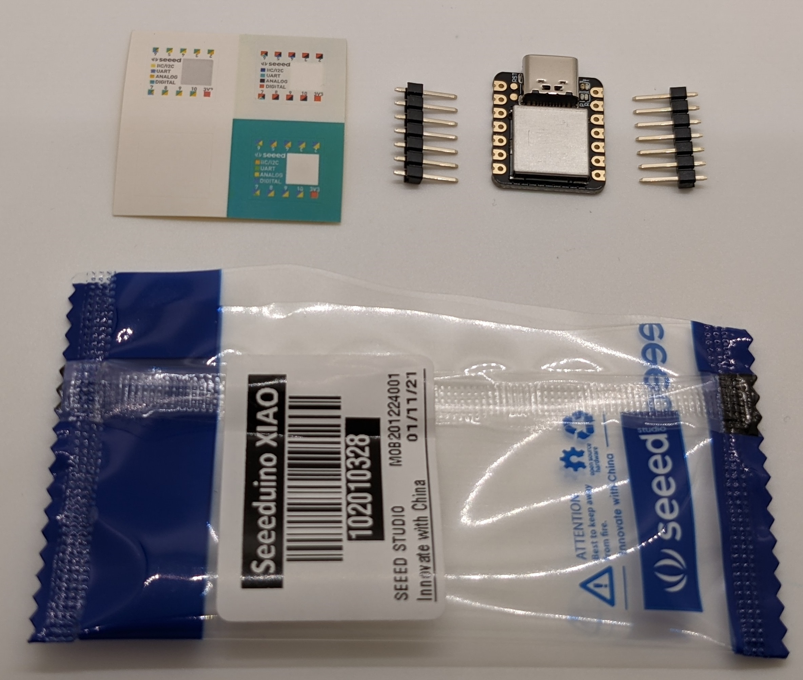

## Step 2
Insert the pin headers into the board long side down. Then, insert the Seeeduino XIAO into the pins. See the picture below for the correct orientation. Note the orientation of the USB port, it should point towards the edge of the board.
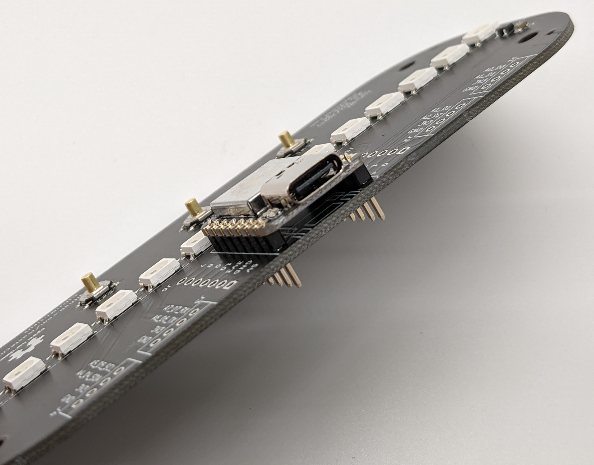

## Step 3
Lock the XIAO into place by using the supplied Assembly Helper bracket. Start with the side closest to the USB port. See the pictures below.
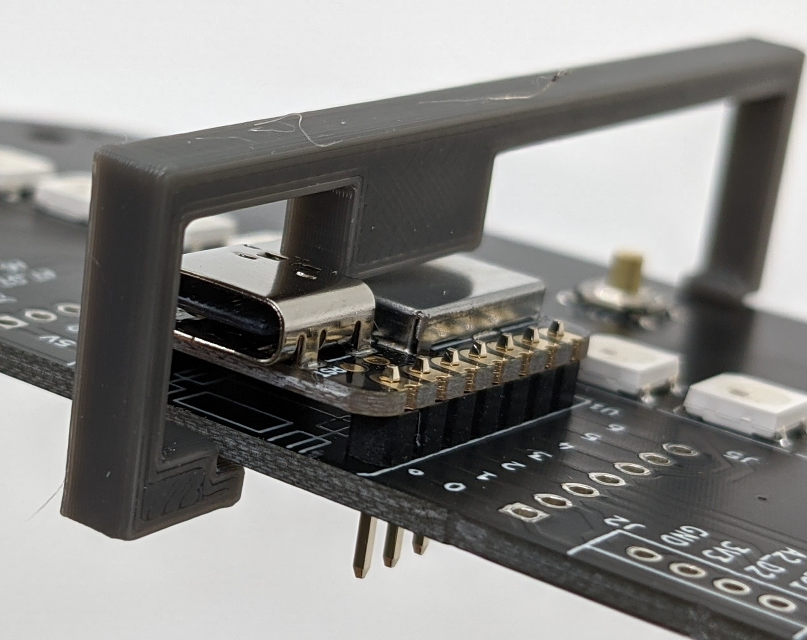
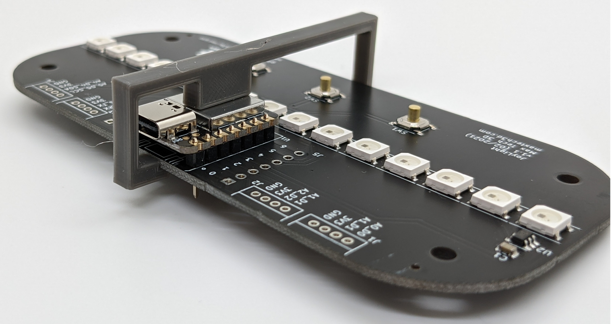

## Step 4
Now, we need to trim the pins protruding through the bottom side of the JoyLight PCB one by one. If left as is, you will not be able to assemble the bottom part of the enclosure. After trimming, the pins should only slightly protrude through the board. See the pictures below as a reference. 

Warning, wear eye protection! When cut, the pins have a tendency to fly away in unpredictable directions. Holding one of your fingers on top of the pin being cut might help a bit.
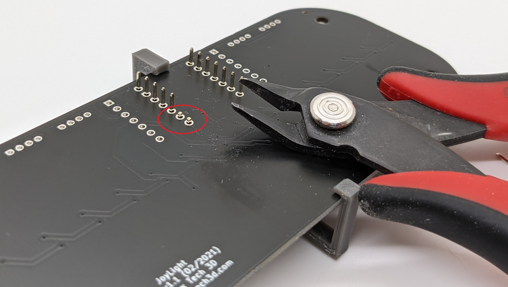
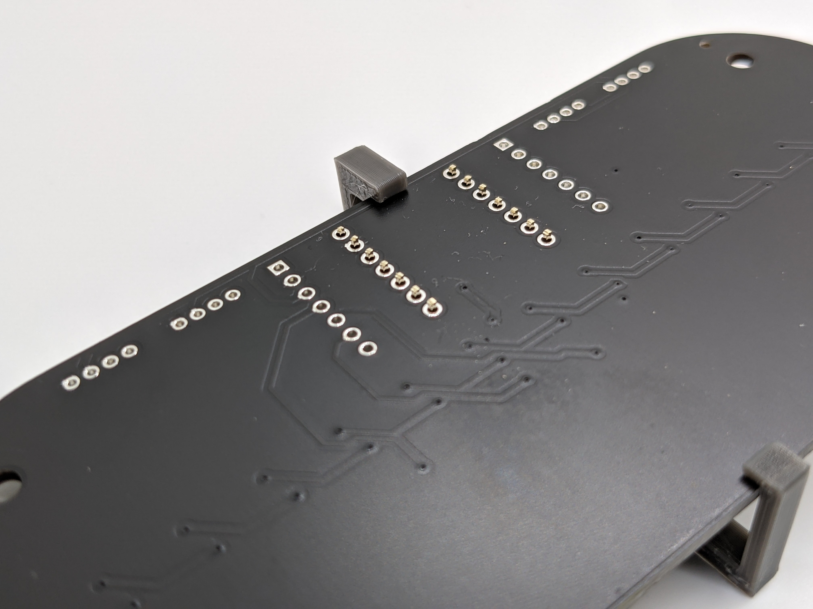

## Step 5
It's now time for the fun part. Warm up the soldering iron and solder all pins on both the top and bottom sides of the board. Be careful not to short pins together. If you do, you can use solder wick to remove the excess solder.
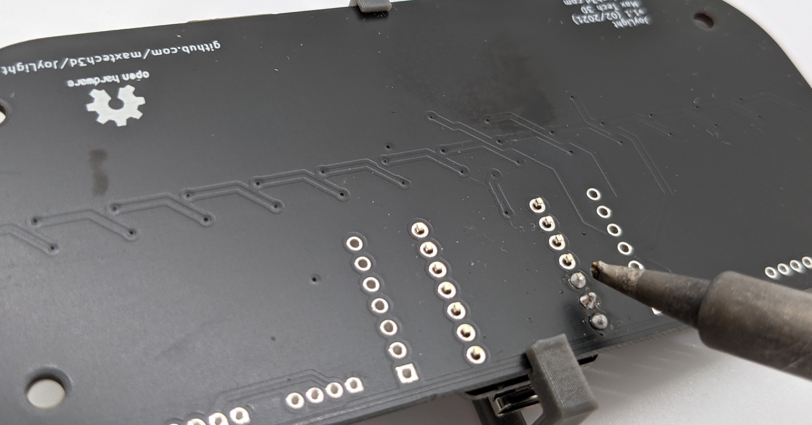
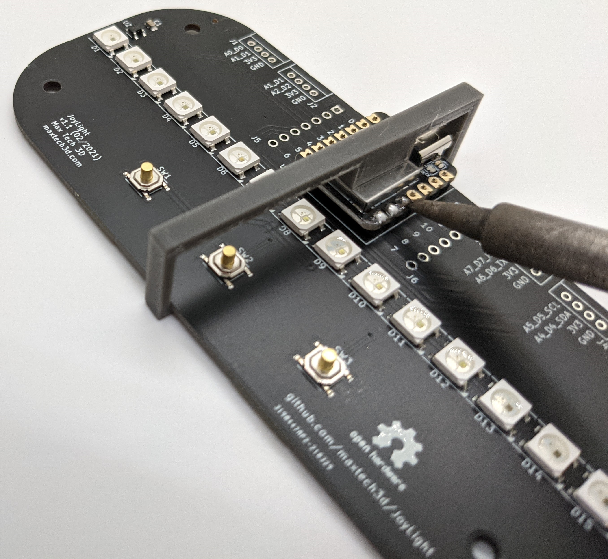

## Step 6
Take off the assembly helper and admire your work. Verify that no pins are shorted together. If you find any shorts, you can use solder wick to remove the excess solder.
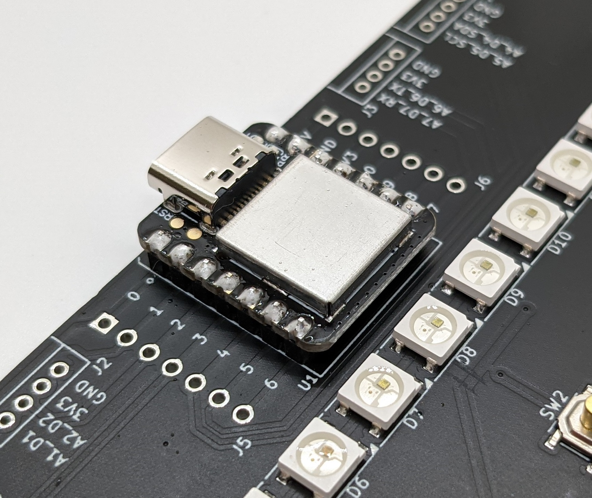
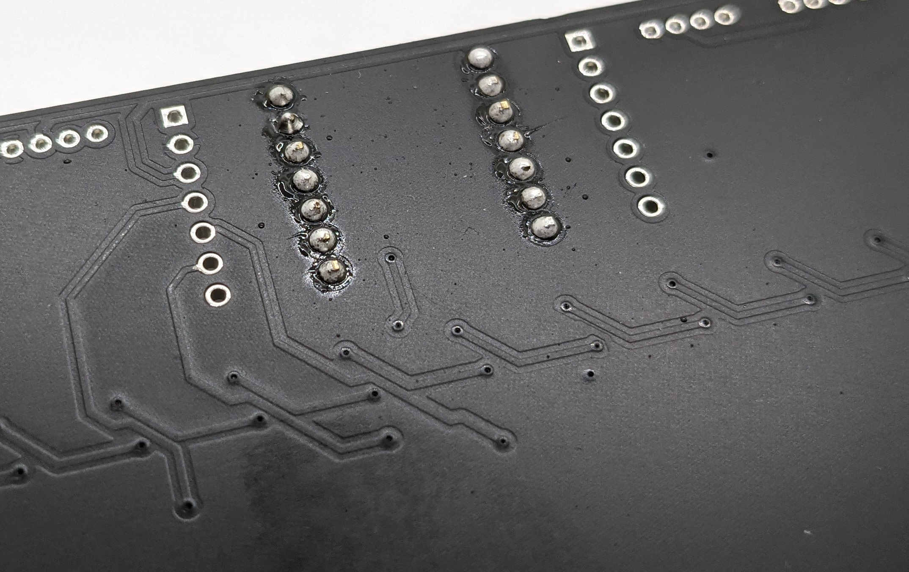

## Step 7 (optional)
You can now apply one of the stickers included in the XIAO kit to the top shield of the board. The only difference between the stickers is in their color, so choose the one you like most! Please note the orientation of the sticker. The white square should be next to the USB port.
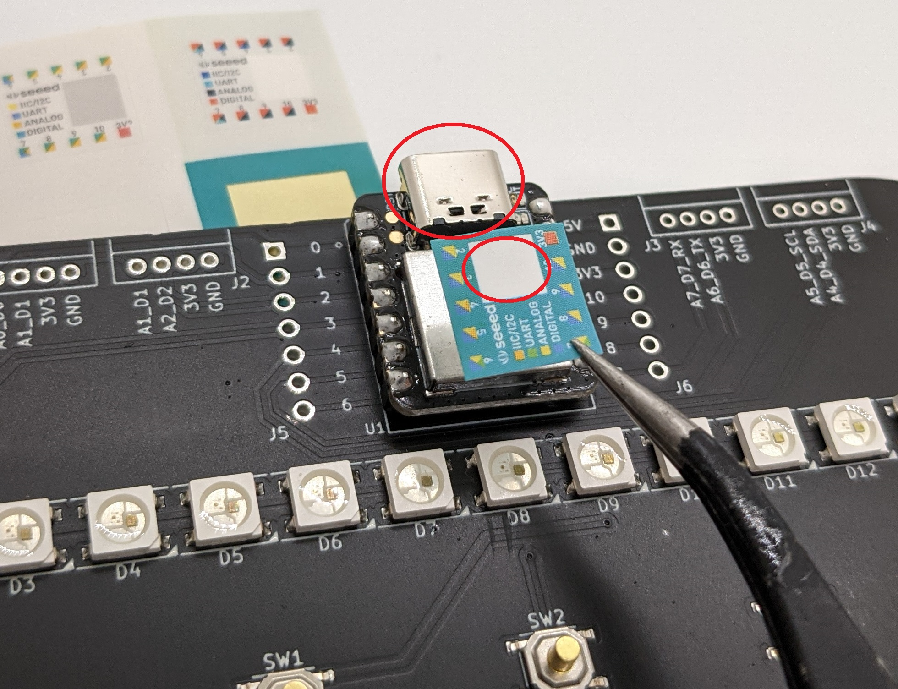
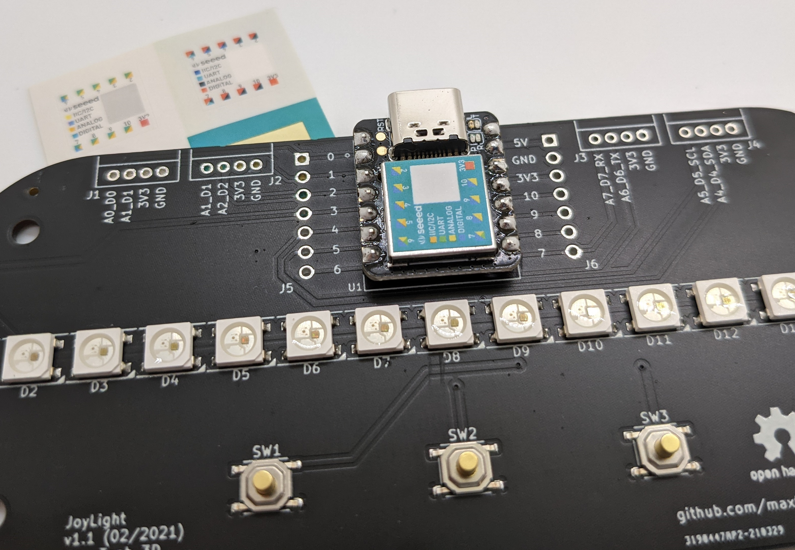

Congratulations, you have finished assembling the JoyLight board all by yourself! You can now proceed to [3D printing the JoyLight enclosure](Enclosure3dPrinting.md) or [Assembling the JoyLight enclosure](EnclosureAssembly.md).

P.S. Wondering what all those unpopulated pin headers are? They're for connecting [Seeeduino Grove boards]https://www.seeedstudio.com/category/Grove-c-1003.html?cat=890. This allows you to connect additional expansions such as light sensors, Bluetooth/WiFi modules or even an OLED display! Stay tuned for a detailed guide. In the meanwile, you can read more information on [their website](https://wiki.seeedstudio.com/Grove_System/)