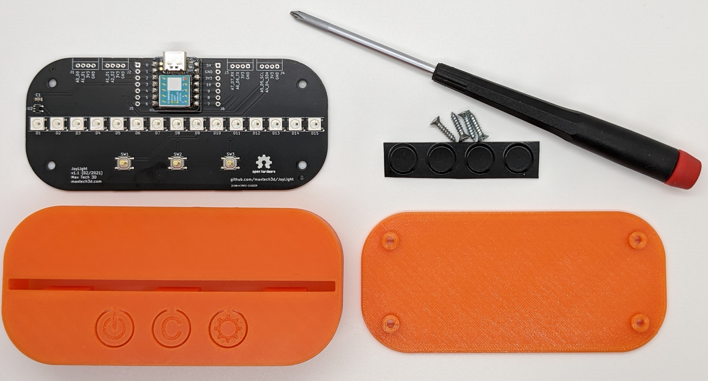
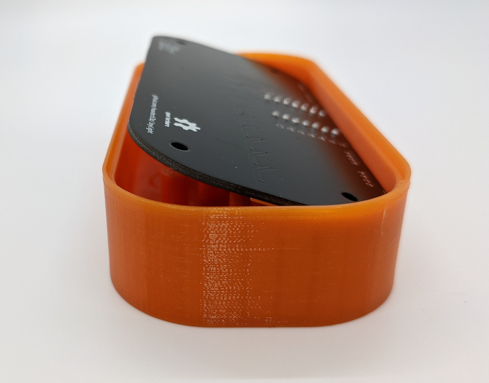
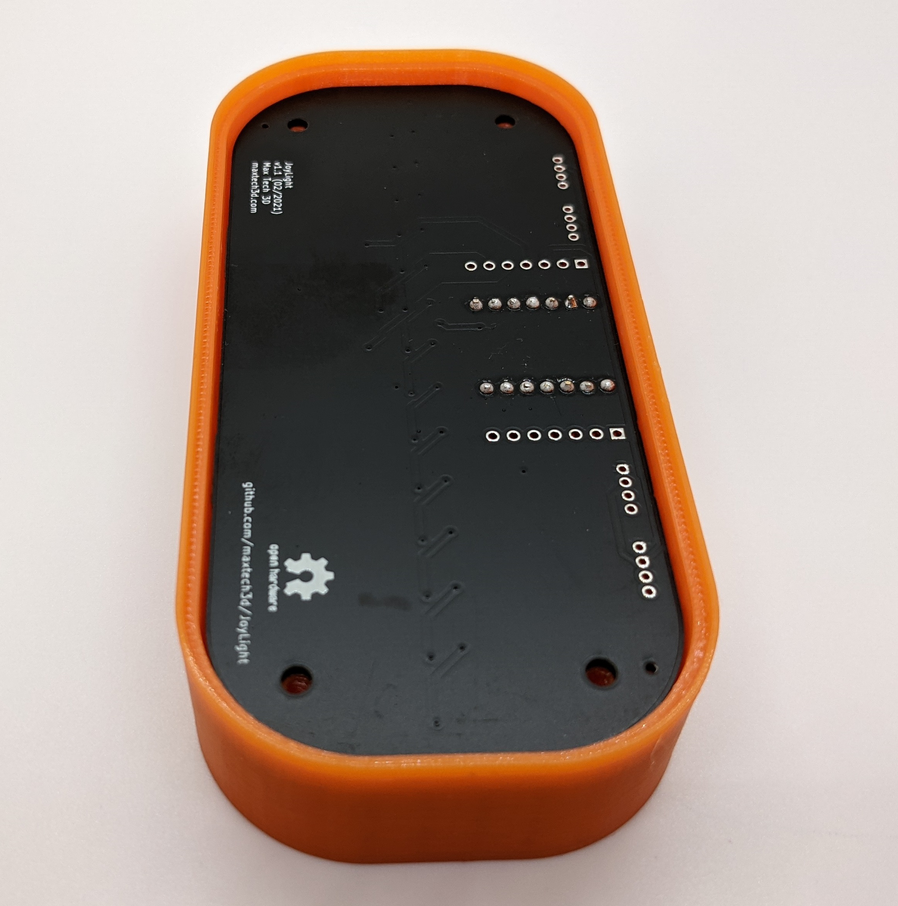
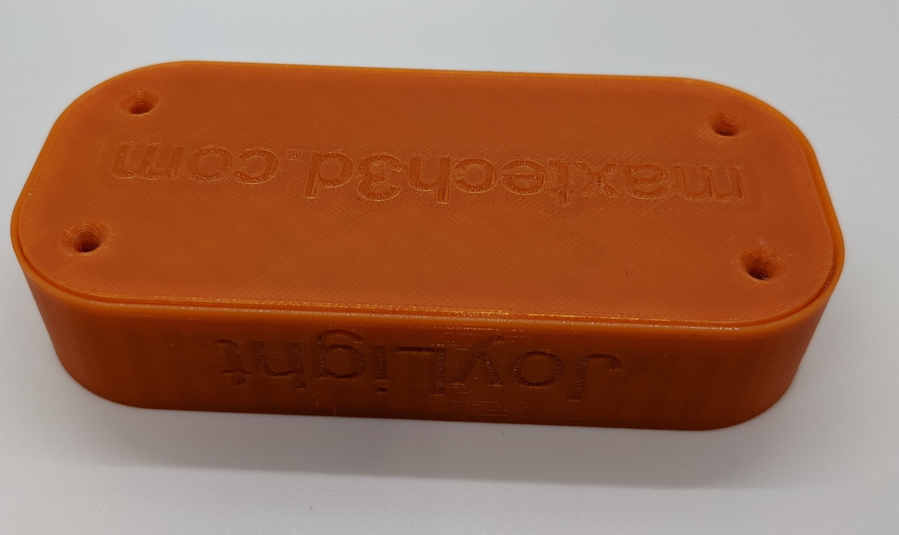
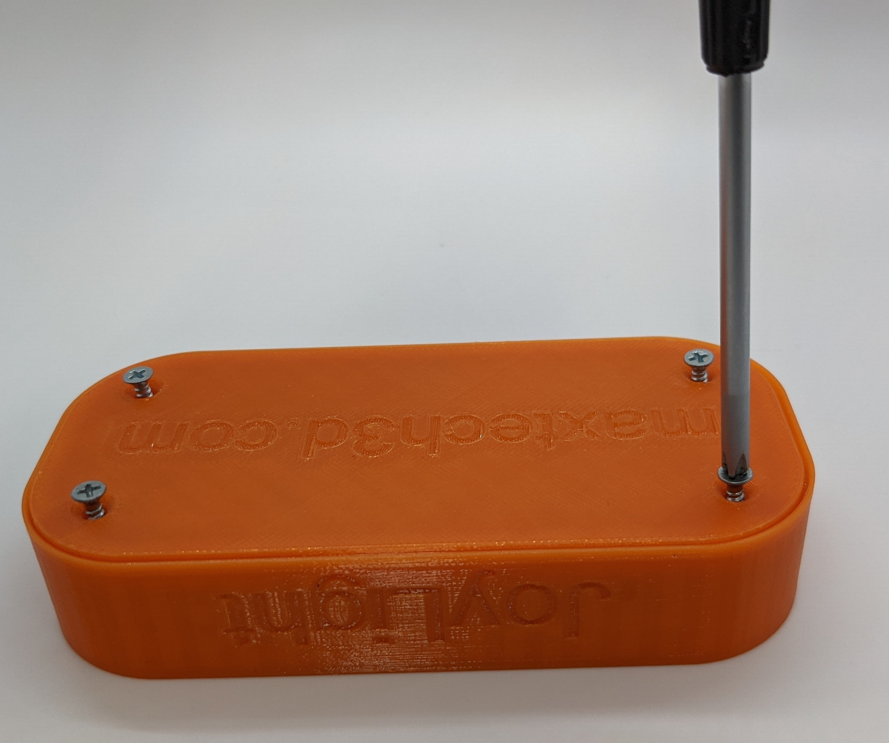
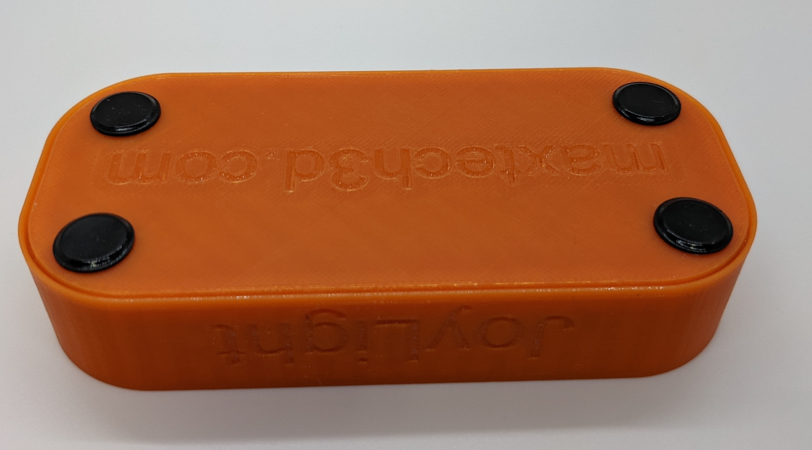
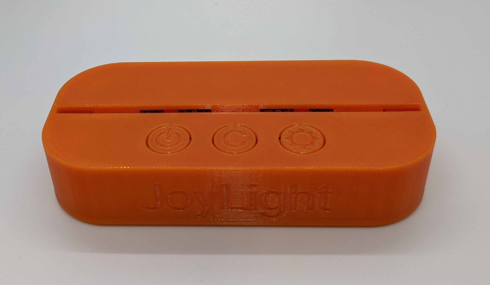

# Enclosure Assembly

Before you begin assembling the enclosure, let's make sure that you have all the required parts:
* One fully assembled JoyLight PCB (the PCB assembly instructions are located [here](ElectronicsAssembly.md))
* 3D printed enclosure - top and bottom halves (the 3D printing instructions are located [here](Enclosure3dPrinting.md))
* Four self tapping 4 x 1/2" screws (included in the JoyLight kit)
* Four 1/2" diameter adhesive rubber feet (included in the JoyLight kit)
* Philips head screwdriver

## Step 1
Slide the PCB inside the 3D printed case. Place the USB side into place first, then drop the other side. You shouldn't need to apply any additional force.

## Step 2
Insert the bottom half of the case. Make sure that the edges are flush with the top half. If not, double check that the pins of the Seeeduino XIAO are properly trimmed (as desribed in the [Electronics Assembly Instructions](ElectronicsAssembly.md))

## Step 3
Using a philips head screwdriver, screw in the four provided screws. Do not overtighten, or the plastic might crack. For the same reason, do not use electric screwdrivers.

## Step 4
Peel off the provided bumper feet and stick them on top of the screws. Roughly center them on top of the screws (it doesn't have to be perfect).

Congratulations, you have completed the assembly! Time to [Program the JoyLight](ArduinoProgramming.md)

